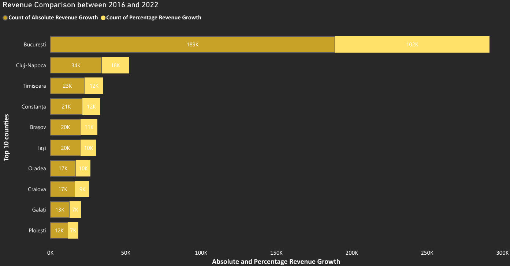
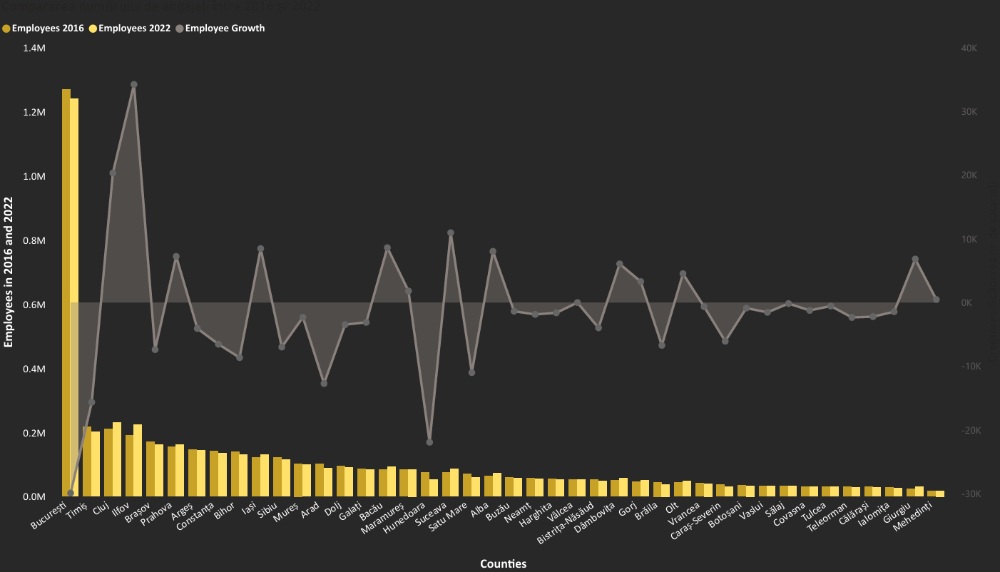
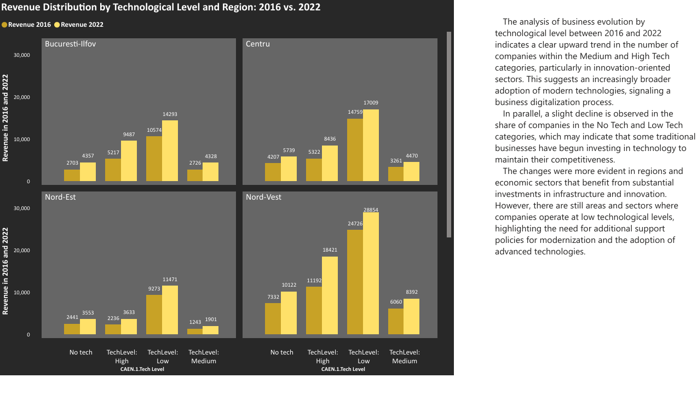
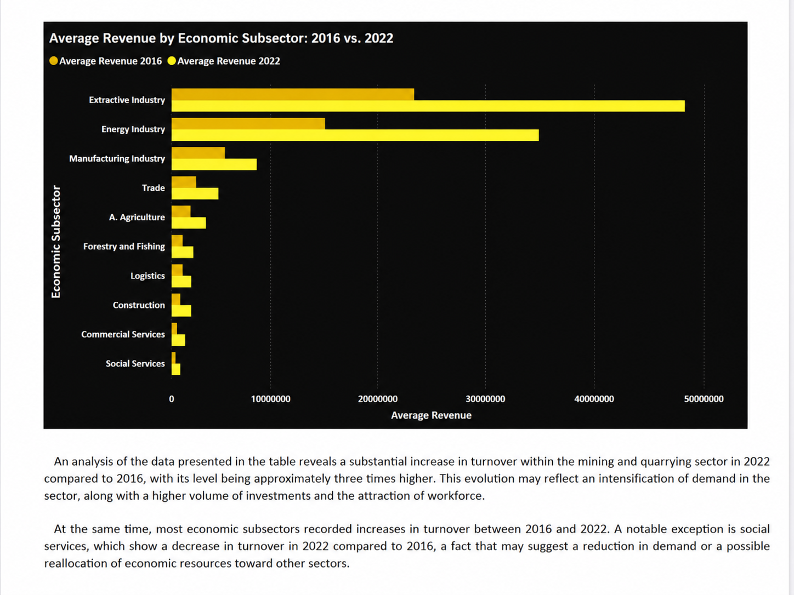
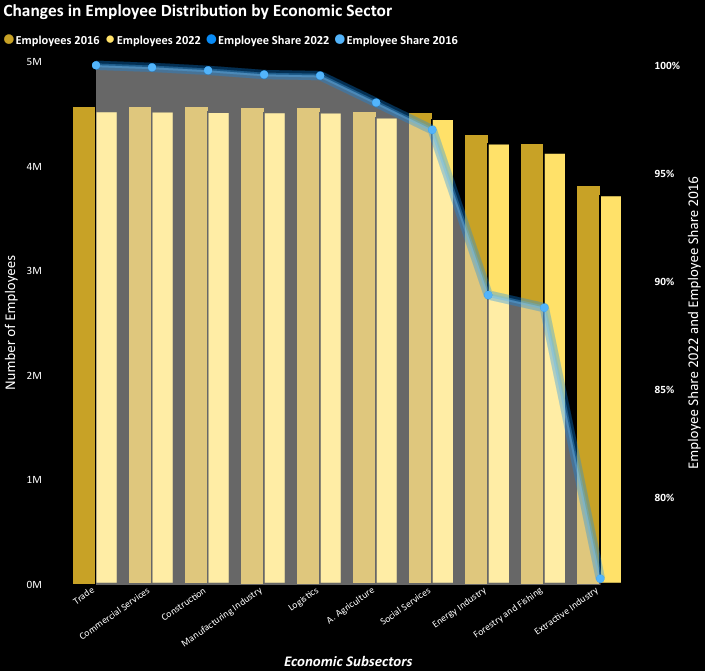
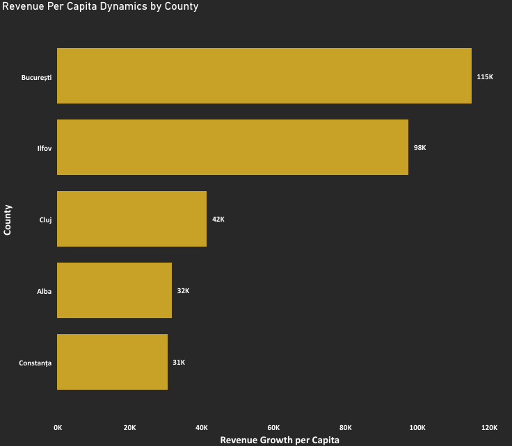

# Power BI Economic Data Business Insights

This project presents a Power BI business analysis case study focused on Romanian companies, economic activity, turnover, workforce dynamics, and technological classification between 2016 and 2022.

The dashboard is designed to support business decision-making by identifying regional and sector-level differences in revenue growth, workforce evolution, company performance, and technological distribution.

## Business Context

Romania's business environment experienced several structural changes between 2016 and 2022, influenced by economic growth, regional development, technological adoption, and changes in workforce distribution.

This Power BI project explores how Romanian companies evolved during this period by analyzing turnover, employee numbers, economic sectors, technological levels, counties, and regions. The dashboard transforms raw economic data into a clear business intelligence report that highlights where growth occurred, which sectors became more dominant, and how workforce dynamics changed over time.

The main purpose of the analysis is to provide a structured overview of economic performance across Romania and to identify relevant differences between regions, counties, and business sectors.

## Project Objectives

- Analyze revenue evolution between 2016 and 2022
- Compare employee distribution across Romanian counties and economic sectors
- Identify regional differences in business activity and workforce dynamics
- Explore the distribution of companies by technological level
- Build an interactive Power BI dashboard for business insight generation
- Practice data cleaning, data modeling, DAX calculations, and data storytelling

## Tools and Skills Used

- Power BI
- Power Query
- DAX
- Data modeling
- Data cleaning
- Data visualization
- Business intelligence reporting
- Data storytelling
- Dashboard design

## Key Insights

- Revenue increased between 2016 and 2022 across several economic sectors, with stronger growth visible in industry-related areas.
- Employee distribution changed across counties and economic sectors, suggesting shifts in workforce demand.
- Certain counties and regions concentrate higher levels of revenue and employment.
- Technological classification helps highlight differences in company activity and regional business development.
- The dashboard provides a clear visual overview of economic performance and workforce dynamics in Romania.

## Dashboard Pages

### 1. Revenue Comparison between 2016 and 2022

This page compares business revenue evolution across the top counties, highlighting both absolute and percentage revenue growth.

### 2. Employee Count Comparison: 2016 vs. 2022

This page compares the number of employees by county in 2016 and 2022 and shows employee growth trends.

### 3. Revenue Distribution by Technological Level and Region

This page shows how revenue is distributed across technological levels and Romanian regions.

### 4. Average Revenue by Economic Subsector

This page presents the average revenue in 2016 and 2022 across different economic subsectors.

### 5. Changes in Employee Distribution by Economic Sector

This page analyzes how employee distribution changed between 2016 and 2022 across economic sectors.

### 6. Regional Economic Analysis

This page highlights regional differences in revenue, workforce, and business activity.

## Main Conclusions

The analysis highlights significant differences in economic performance across Romanian counties, regions, and economic sectors between 2016 and 2022.

Revenue growth was stronger in specific economic sectors, especially industry-related areas, while workforce distribution showed visible changes across counties and subsectors. These differences may indicate changes in business development, labor demand, and regional economic concentration.

The dashboard also shows that economic activity is not evenly distributed across Romania. Certain counties and regions have a stronger presence in terms of revenue and employment, while others remain less represented in the overall business landscape.

Overall, this project demonstrates how Power BI can be used to clean, model, analyze, and visualize economic data in order to generate business insights and support data-driven decision-making.

## Files Included

- `PowerBI_Economic_Activity_Workforce_Analysis.pbix` – Power BI project file
- `PowerBI_Economic_Activity_Workforce_Analysis.pdf` – exported dashboard report
- Dashboard screenshots used for portfolio presentation

## Purpose of the Project

This project was created as part of my data analytics portfolio. It demonstrates practical skills in data preparation, data modeling, Power BI dashboard design, DAX calculations, data visualization, and business insight generation.

## Author

Ramona Toader
